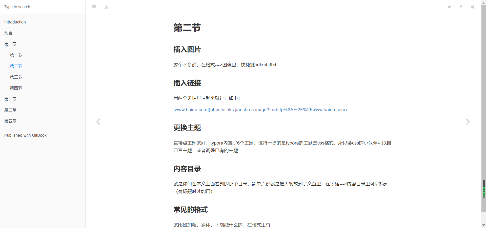

# 第三节

## 生成电子书

写完后我们可以执行`gitbook serve`来预览这本书，执行后会把Markdown格式的文档转换为html格式，最后提示"Serving book on [http://localhost:4000](https://links.jianshu.com/go?to=http%3A%2F%2Flocalhost%3A4000)"此时用浏览器打开" [http://localhost:4000](https://links.jianshu.com/go?to=http%3A%2F%2Flocalhost%3A4000)"即可预览书本

